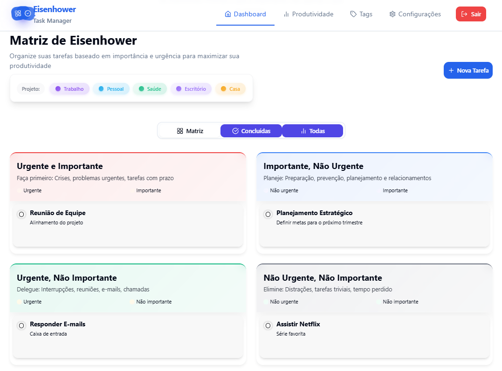

# 🦅 Task Eagle Eye

<div align="center">
  
  
  <p><strong>Gerencie suas tarefas com a precisão de uma águia</strong></p>
  
  <p>Um gerenciador de tarefas moderno baseado na Matriz de Eisenhower, projetado para maximizar sua produtividade e facilitar a organização pessoal.</p>

  <p>
    <a href="#-funcionalidades">Funcionalidades</a> •
    <a href="#-instalação">Instalação</a> •
    <a href="#-uso">Uso</a> •
    <a href="#-contribuição">Contribuição</a> •
    <a href="#-licença">Licença</a>
  </p>

  <p>
    
    
    
    
  </p>
</div>

## 🚀 Visão Geral

Task Eagle Eye é uma aplicação web moderna de gerenciamento de tarefas que implementa a famosa **Matriz de Eisenhower** para ajudar você a priorizar suas atividades de forma eficiente. Com uma interface intuitiva e funcionalidades poderosas, o aplicativo permite organizar tarefas em quatro quadrantes baseados em urgência e importância.

### 🎯 Matriz de Eisenhower

| | **Urgente** | **Não Urgente** |
|---|---|---|
| **Importante** | 🔥 **Faça Agora**<br/>Crises, emergências | 📅 **Agende**<br/>Planejamento, prevenção |
| **Não Importante** | ⚡ **Delegue**<br/>Interrupções, algumas ligações | 🗑️ **Elimine**<br/>Distrações, atividades desnecessárias |

## ✨ Funcionalidades

### 🎨 Interface e Experiência
- **Interface moderna e responsiva** com design limpo
- **Múltiplos temas visuais** para personalização
- **Animações suaves** e feedback visual
- **Modo offline** com sincronização automática
- **PWA (Progressive Web App)** - instale como app nativo

### 📋 Gerenciamento de Tarefas
- **Matriz de Eisenhower interativa** para priorização
- **Criação rápida de tarefas** com descrições detalhadas
- **Sistema de tags** para categorização
- **Filtros avançados** por status, prioridade e tags
- **Busca inteligente** em todas as tarefas
- **Drag & drop** para reorganização

### 🔗 Integrações
- **Google Calendar** - sincronização bidirecional
- **Notion** - importação de tarefas
- **Supabase** - armazenamento em nuvem
- **Firebase Auth** - autenticação segura

### 🛡️ Segurança e Performance
- **Autenticação robusta** com múltiplos provedores
- **Proteção CSRF** e sanitização de entradas
- **Rate limiting** para prevenir abuso
- **Criptografia de dados** sensíveis
- **Carregamento otimizado** e cache inteligente

## 💻 Tecnologias

<div align="center">
  
  
  
  
  
</div>

<div align="center">
  
  
  
  
</div>

### Stack Técnica

- **Frontend**: React 18, TypeScript, Vite
- **UI/UX**: Tailwind CSS, shadcn/ui, Radix UI
- **Backend**: Supabase (PostgreSQL, Auth, Storage)
- **Autenticação**: Firebase Auth
- **Integrações**: Google Calendar API, Notion API
- **Deploy**: Vercel/Netlify
- **Testes**: Jest, React Testing Library
- **Linting**: ESLint, Prettier

## 🔧 Instalação e Uso

### Pré-requisitos
- Node.js & npm - [instale com nvm](https://github.com/nvm-sh/nvm#installing-and-updating)

### Exemplos de Uso

Veja abaixo como é fácil gerenciar suas tarefas com o Task Eagle Eye:

- **Adicionar Tarefas**: Crie novas tarefas rapidamente com descrições detalhadas e prazos.
- **Acompanhar Progresso**: Use o dashboard para visualizar o progresso de suas tarefas em tempo real.
- **Colaboração**: Compartilhe tarefas com sua equipe e acompanhe o progresso coletivo.

### Opções de Desenvolvimento

<details>
<summary><b>💻 Usar seu IDE Preferido</b></summary>
<br>

```sh
# Passo 1: Clone o repositório {#passo-1-clone-o-repositório  data-source-line="95"}
git clone <URL_DO_GIT>

# Passo 2: Navegue até o diretório do projeto {#passo-2-navegue-até-o-diretório-do-projeto  data-source-line="98"}
cd task-eagle-eye

# Passo 3: Instale as dependências {#passo-3-instale-as-dependências  data-source-line="101"}
npm i

# Passo 4: Inicie o servidor de desenvolvimento {#passo-4-inicie-o-servidor-de-desenvolvimento  data-source-line="104"}
npm run dev
```sh
# Passo 5: Abra o projeto no navegador {#passo-5-abra-o-projeto-no-navegador  data-source-line="106"}
npm run start
```
</details>

<details>
<summary><b>🌐 Editar Diretamente no GitHub</b></summary>
<br>

1. Navegue até o(s) arquivo(s) desejado(s)
2. Clique no botão "Editar" (ícone de lápis) no canto superior direito
3. Faça suas alterações e confirme o commit
</details>

<details>
<summary><b>☁️ Usar GitHub Codespaces</b></summary>
<br>

1. Navegue até a página principal do repositório
2. Clique no botão "Code" (verde)
3. Selecione a aba "Codespaces"
4. Clique em "New codespace"
5. Edite os arquivos e faça commit das alterações quando terminar
</details>

## 🌟 Funcionalidades

- ⏱️ **Gerenciamento de tempo** - Acompanhe o tempo gasto em cada tarefa
- 📊 **Dashboards personalizados** - Visualize seu progresso com gráficos intuitivos
- 🔔 **Notificações inteligentes** - Receba lembretes no momento certo
- 🔄 **Sincronização em nuvem** - Acesse suas tarefas em qualquer dispositivo
- 🤝 **Colaboração em equipe** - Compartilhe projetos e delegue tarefas

### 💝 Apoie o Projeto

[](https://github.com/felixskmarcio)
[](https://www.paypal.com/invoice/p/#7VXJY445W6S2VG2L)

## 🤝 Contribuição

Contribuições são bem-vindas! Se você deseja contribuir com o projeto, siga estas etapas:

1. Faça um fork do repositório.
2. Crie uma nova branch para suas alterações.
3. Envie um pull request com uma descrição detalhada das mudanças.

Para reportar problemas ou sugerir melhorias, abra uma issue no GitHub.

## 📝 Licença

Este projeto está licenciado sob a Licença MIT - veja o arquivo LICENSE para detalhes.

